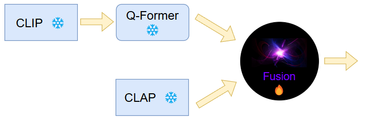

# Sight meets Sound: Leveraging Audio for Improved Video Moment Retrieval using Multimodal Large Language Models

* Authors: Joël Tschesche, Habib Maraqten, Christian Bialas, Ahmed Fourati, Leon Wenderoth 


We introduce SMS (Sight meets Sound), a multimodal, single-stage model that extends Chrono ([arxiv](http://arxiv.org/abs/2406.18113)) by multimodal audio-vision reasoning capabilities for Video Moment Retrieval. 
We achieve new state-of-the-art results on the challenging Charades-STA benchmark, and competitive results on QVHighlights.

<p align="center">
  
</p>

<p align="center">
  
</p>

# Code structure

```bash

# data & data preprocessing
./mr_BLIP_data

# pretrained checkpoints from MR.BLIP
./mr_BLIP_checkpoints

# model code
./lavis/

# running scripts for training and inference
./run_scripts

```

# Setup

## Install Dependencies

1. (Optional) Creating conda environment from .yaml file

```bash
cd mr-Audio/envs
conda env create -f SMS.yaml
conda activate sms-env

```

2. build from source

```bash
conda create -n SMS python=3.8
pip install -r requirements.txt
```

## Download Pretrained Models
Checkpoints of MR. BLIP can be used for fine-tuning and training (use only Charades-STA and QVHighlights)
Download the [checkpoints](https://drive.google.com/drive/folders/1AR-rdUillx0fy7KS4zbEuswFMl7qR9Gj?usp=sharing) and put them under /mr_BLIP_checkpoints.

# Dataset Preparation

We test our model on:

* [Charades-STA](https://github.com/jiyanggao/TALL)
  * [Charades (Videos)](https://prior.allenai.org/projects/charades)

* [QVHighlights](https://github.com/jayleicn/moment_detr)

Please download original MR data and preprocess them via our [scripts](mr_BLIP_data/data_preprocess.ipynb).

# Training and Inference

We provide SMS training and inference script examples as follows.

And please refer to [dataset page](lavis/configs/datasets/) to customize your data path.

You might want to update the [config files](lavis/projects/mr_BLIP/train/) for the respective runs to fit on your machine. They are currently set to run on 4 A100-80GB GPUs for Charades-STA and 8 A100-80GB GPUs for QVHighlights. You can simply reduce the batch size, reduce the number of frames, or apply a frame level embeddings aggregation (32 frame tokens -> 1 token) to fit on a smaller GPU.

## 1) QVH Finetuning

```bash
sh run_scripts/mr_BLIP/train/qvh.sh
```

## 2) Charades-STA Finetuning

```bash
sh run_scripts/mr_BLIP/train/charades.sh
```


## 4) QVH Evaluation

Should roughly return:
|               | R1@0.5        | R1@0.7    | mAP@0.5  | mAP@0.75  |
| ------------- |:-------------:| :-----:   | :-----:  | --------: |
| *SMS*    | **76.39**     | **61.35**| **69.09**| **54.07** |

```bash
sh run_scripts/mr_BLIP/eval/qvh.sh
```

## 5) Charades-STA Evaluation

Should roughly return:
|               | R1@0.5        | R1@0.7   | mIoU      |
| ------------- |:-------------:| :-----:  | --------: |
| *SMS*         | **72.54**     | **51.0**| **60.90**  |

```bash
sh run_scripts/mr_BLIP/eval/charades.sh
```

# Additional Branches

We also explore different model variations or setups in the following branches:

- [attention_fusion](https://github.com/globc/mr-Audio/tree/attention_fusion)
- [clap_interleave](https://github.com/globc/mr-Audio/tree/clap_interleave)
- [xinstructblip](https://github.com/globc/mr-Audio/tree/xinstructblip)
- [MultiModalSequenceFusion](https://github.com/globc/mr-Audio/tree/MultiModalSequenceFusion)
- [AudioOnly](https://github.com/globc/mr-Audio/tree/AudioOnly)
- [CLAP2](https://github.com/globc/mr-Audio/tree/CLAP2)


# Acknowledgments

We thank the developers of [LAVIS](https://github.com/salesforce/LAVIS) and [BLIP-2](https://github.com/salesforce/LAVIS/tree/main/projects/blip2) for their public code release.


